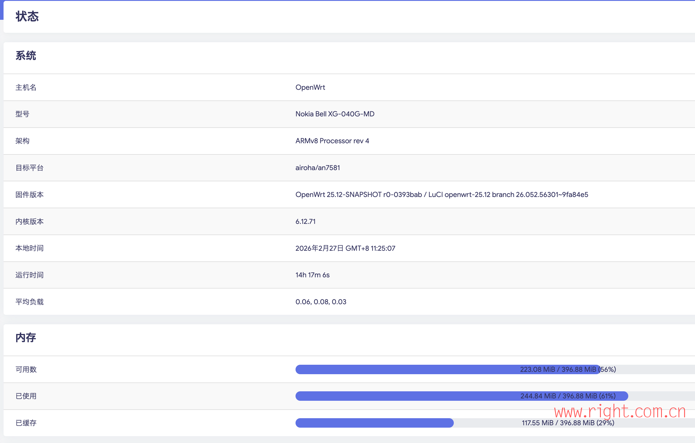
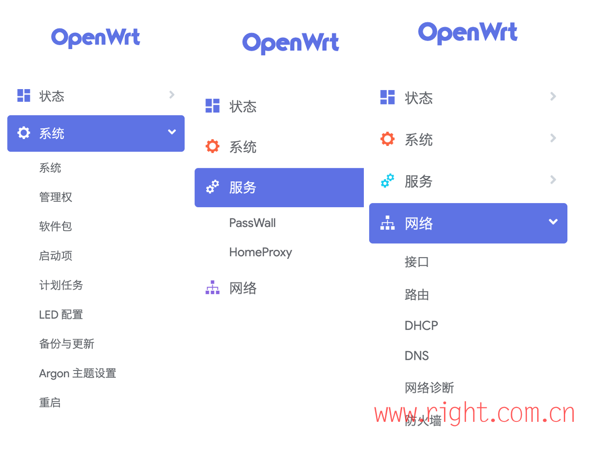

# OpenWrt for XG-040G-MD

OpenWrt / ImmortalWrt firmware for the NOKIA BELL XG-040G-MD.

Source tree: [https://github.com/xiangtailiang/openwrt](https://github.com/xiangtailiang/openwrt) (OpenWrt variant) and [immortalwrt/immortalwrt](https://github.com/immortalwrt/immortalwrt) (ImmortalWrt variant).

- Fully adapted to the SkyHigh SPI-NAND flash and stable in operation (uses the official Robust Read Workaround patch).
- Images are built from the OpenWrt 25.12 stable branch, the OpenWrt main (snapshot) branch, or ImmortalWrt master.
- Ships LuCI, kept as small as reasonably possible, without unnecessary extra packages.

## Included LuCI apps

The firmware focuses on core routing plus proxy functionality, kept lean:

- **Base UI**: LuCI (HTTPS enabled), language packs
- **Default theme**: Argon (with settings page); native Bootstrap retained
- **Network & security**: firewall (nftables-based), dnsmasq (DHCP/DNS/IPv6)
- **Proxy**: HomeProxy, PassWall (with xray-core)
- **PON management (ImmortalWrt variant)**: airoha-xpon-luci UI overlay (see PON support below)

## PON support

PON on this device is made of three independent layers. Read `STATUS.md` for the full, honest breakdown; the short version:

1. **PCS / SerDes physical layer** - already present in ImmortalWrt mainline. The `nokia_xg-040g-md` device enables `&pon_pcs` / `&eth_pcs` (driver `airoha,an7581-pcs-pon`) in `an7581.dtsi`. No custom kernel patches are needed for the ImmortalWrt build.
2. **Management UI** - `naoki66/airoha-xpon-luci`, installed as a **root filesystem overlay** (not a package) by `scripts/add-pon-overlay.sh`, wired into the ImmortalWrt workflow.
3. **Vendor userspace + kernel data path** - the proprietary Airoha tools (`ponmgr`, `omcicfgCmd`, `epon_oam`, ...) and kernel modules (`xpon_int.ko`, `ponvlan.ko`, `/dev/pon`, the `pon`/`oam` interfaces). These are **not public**. Without them the UI installs and the physical layer works, but full GPON/EPON authentication (OMCI/OAM) will not complete.

If you need a build with the fullest available PON integration for this SoC family, the actively maintained reference is `naoki66/ImmortalWrt-for-Gemtek-XG2010G`, which already carries this device.

## Flashing

1. **Flash U-Boot**: [see the general XG-040G-MD flashing guide](https://nwrt.kuroneko.host/flashdocs/XG-040G-MD.html)
2. **Flash the system**: in the U-Boot web recovery UI, upload and flash the **factory** image from this repository's Releases page.

> [!WARNING]
> **How to enter U-Boot correctly:**
> Power on the router, wait **3 seconds**, then press and hold the reset button.
> **Do not** hold reset before powering on, or the device enters the low-level rescue mode (MaskROM/Emergency) and you will not reach the U-Boot web UI.

## Screenshots

### System overview

### Interfaces and network

## Docs

- `docs/npu-firmware-load.md`: analysis and fix notes for the NPU firmware load error (`-2`).
- `STATUS.md`: what works, what doesn't, and why - especially for PON.
